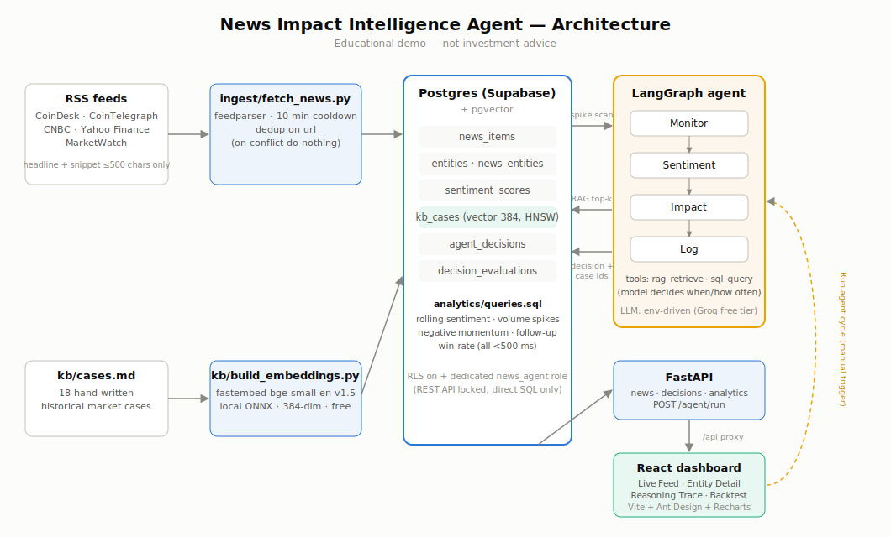
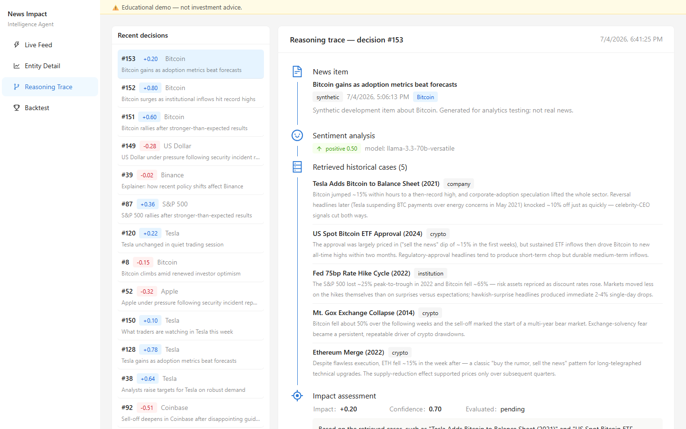
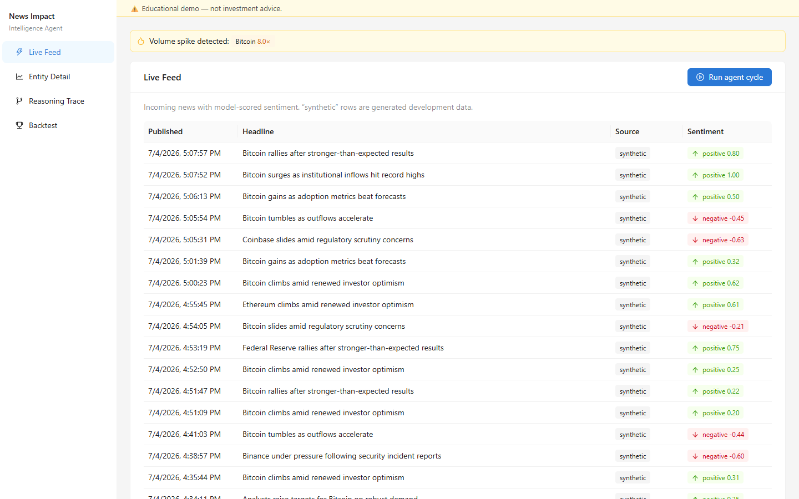
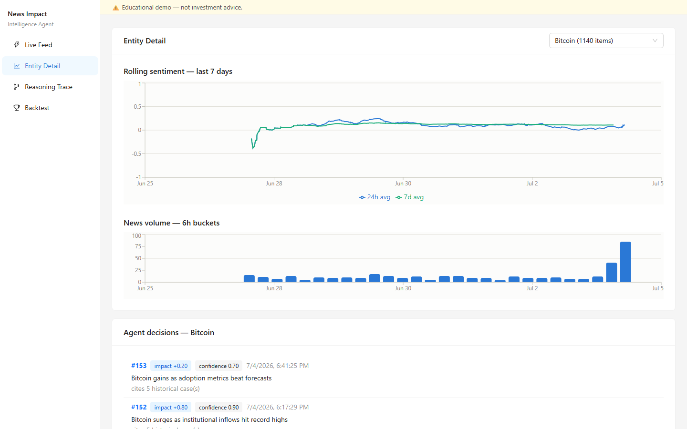
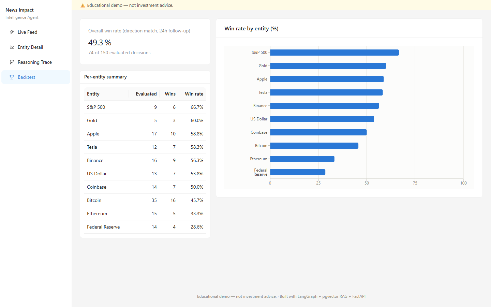

# News Impact Intelligence Agent

An autonomous multi-agent system that monitors financial/crypto news,
extracts sentiment and entities via NLP (Claude API), retrieves similar
historical cases via RAG (pgvector), and produces confidence-scored
market-impact assessments through a LangGraph agent graph. Every decision
is logged with its full RAG trace and is queryable via SQL for
backtesting.

> **⚠️ Disclaimer: educational demo — not investment advice.**
> This is a portfolio project. Nothing it produces should be used to make
> trading or investment decisions.

## Architecture



See [SPEC.md](SPEC.md) for the full engineering spec and phase plan.

## Screenshots

### Reasoning Trace — the core demo

For every decision, the full agentic chain: news item → LLM sentiment →
which historical cases the model chose to retrieve (RAG audit trail) →
impact score, confidence, and reasoning that cites those cases by name.



### Live Feed



### Entity Detail



### Backtest



## Tech stack

Postgres (Supabase, pgvector) · Python (feedparser, psycopg) · Claude API ·
LangGraph · FastAPI · React + Vite + Ant Design + Recharts

## Setup

1. **Database** — create a Supabase project, then apply the schema:

   ```bash
   psql "$DATABASE_URL" -f db/schema.sql
   ```

   (or paste `db/schema.sql` into the Supabase SQL editor)

2. **Environment** — copy `.env.example` to `.env` and fill in
   `DATABASE_URL` and `ANTHROPIC_API_KEY`.

3. **Python deps**

   ```bash
   python -m venv .venv
   .venv\Scripts\activate        # Windows (source .venv/bin/activate on unix)
   pip install -r requirements.txt
   ```

4. **Ingest news**

   ```bash
   python ingest/fetch_news.py
   ```

   Re-running within 10 minutes is skipped (RSS etiquette); duplicate URLs
   are never inserted twice.

5. **Synthetic dev data + analytics** — real RSS volume is too thin to
   exercise the analytics windows, so seed ~5,000 marked-synthetic rows:

   ```bash
   python ingest/generate_synthetic_news.py           # seed
   python analytics/benchmark.py                      # time the 5 queries (<500ms each)
   python ingest/generate_synthetic_news.py --purge   # remove synthetic rows
   ```

   The 5 analytics queries (rolling sentiment, volume-spike detection,
   negative momentum, decision follow-up, win-rate) live in
   [analytics/queries.sql](analytics/queries.sql) and are parsed by
   [analytics/loader.py](analytics/loader.py) — the API reuses these same
   queries.

6. **Run the app** — two terminals:

   ```bash
   # backend (port 8000)
   .venv\Scripts\python -m uvicorn api.main:app --reload --port 8000
   # dashboard (port 5173, proxies /api to the backend)
   cd dashboard && npm install && npm run dev
   ```

   Open <http://localhost:5173> — Live Feed, Entity Detail (trend charts),
   Reasoning Trace (the full headline → sentiment → retrieved cases →
   impact chain per decision), and Backtest (win-rate).

### Scheduling options

- **Simple loop (local dev):** `python ingest/fetch_news.py --loop`
  fetches every 15 minutes until stopped.
- **Cron (unix):** `*/15 * * * * cd /path/to/repo && python ingest/fetch_news.py`
- **Task Scheduler (Windows):** create a task running
  `python ingest\fetch_news.py` every 15 minutes.

## Project status

- [x] Phase 1-2 — schema + RSS ingest (verified: 5/5 feeds live, dedup works)
- [x] Phase 3-4 — SQL analytics layer (`analytics/queries.sql`, all 5 queries <500ms)
- [x] Phase 5-6 — knowledge base + RAG (`kb/`, 18 cases, local fastembed embeddings)
- [x] Phase 7-9 — LangGraph multi-agent graph (`agents/`) — code complete;
      end-to-end run needs a free `GROQ_API_KEY` in `.env`
- [x] Phase 10-11 — FastAPI + React dashboard (4 pages, live data)
- [x] Phase 12 — architecture diagram, screenshots, wrap-up

## Resume bullets

- **Shopee-leaning (analytics):** Built an end-to-end news-intelligence
  pipeline (Python, PostgreSQL) ingesting 5 RSS sources with
  deduplication and rate-limit etiquette; designed 6 parameterized SQL
  analytics (window-function rolling sentiment, CTE-based volume-spike
  detection, momentum ranking, self-evaluation backtest) all serving
  <500 ms over ~5,000 rows, surfaced through a FastAPI + React (Ant
  Design/Recharts) dashboard.
- **CyberPay-leaning (agentic AI):** Designed a LangGraph multi-agent
  system (Monitor → Sentiment → Impact → Log) where the Impact node
  autonomously decides when and how often to call RAG-retrieval and SQL
  tools over a pgvector knowledge base of hand-curated historical market
  cases, producing confidence-scored impact assessments whose reasoning
  cites retrieved precedents — with the full decision trail (RAG case
  IDs, sentiment, reasoning) logged to Postgres and rendered as an
  auditable reasoning-trace UI.
